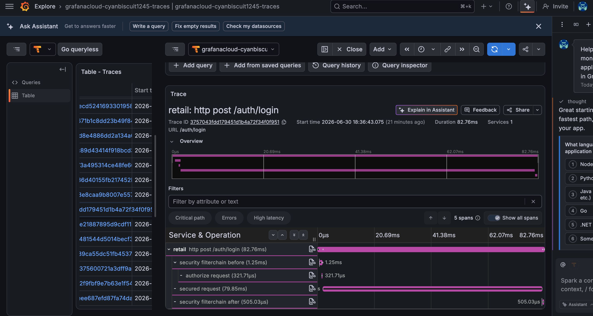

# Retail Backend — Spring Boot 3.5 / Java 17

[](https://github.com/suissitakwa/retail/actions/workflows/build.yml)

Production-style e-commerce backend built to demonstrate backend engineering, cloud-native delivery, and AI integration.

**Live demo:** [retail-novamart.netlify.app](https://retail-novamart.netlify.app) — frontend on Netlify, backend on Railway  
**Production infra:** Kubernetes manifests + Jenkins CD pipeline targeting GKE ([retail-infra](https://github.com/suissitakwa/retail-infra))

**Frontend:** https://github.com/suissitakwa/retail-ui  
**Microservices layer:** https://github.com/suissitakwa/retail-microservices  
**Infrastructure / CD:** https://github.com/suissitakwa/retail-infra  
**Portfolio:** https://portfolio-showcase--suissitakwa.replit.app

---

## Tech Stack

| Concern | Technology |
|---|---|
| Runtime | Java 17, Spring Boot 3.5 |
| Persistence | PostgreSQL + Spring Data JPA + Flyway (migrations V1–V6) |
| Caching | Redis via Spring Cache (`spring.cache.type=redis`) |
| Messaging | Apache Kafka — async order + payment event flow |
| Payments | Stripe (session checkout + webhook-driven confirmation) |
| Auth | JWT (HS256) — access token 2.4 h, refresh 7 d + token revocation |
| Email | Resend HTTP API — transactional emails via HTTPS (Railway-compatible) |
| Rate limiting | Bucket4j — per-IP token bucket on auth endpoints (5 req / min) |
| Resilience | Resilience4j circuit breakers on Stripe + OpenAI calls |
| AI | OpenAI GPT-4o-mini — backend-controlled facts, no direct DB access |
| Observability | Prometheus metrics via Spring Boot Actuator + Micrometer; OpenTelemetry distributed tracing |
| Load testing | k6 — public/authenticated concurrency scenarios in `loadtest/` |
| Containerisation | Docker (multi-stage build) |
| CI | GitHub Actions — compile, unit tests, Testcontainers integration tests, Docker push |
| CD | Jenkins → GKE (`retail-dev` namespace) |

---

## Architecture

```
┌──────────────────────────────────────────────────────────────────┐
│                    REST API  :8080                                │
│  /auth/**  /api/v1/products  /api/v1/orders  /api/v1/cart  …    │
└────────────────────────┬─────────────────────────────────────────┘
                         │ JwtAuthenticationFilter (stateless)
              ┌──────────┴──────────┐
              │   Spring Security   │
              │  ROLE_CUSTOMER      │
              │  ROLE_ADMIN         │
              └──────────┬──────────┘
       ┌──────────────────┼──────────────────┐
       ▼                  ▼                  ▼
  PostgreSQL           Redis              Kafka
  (Flyway DDL)      (hot reads)     order.created
                                    payment.processed
```

**Package layout** — flat package-per-domain under `com.retail_project`:

| Package | Responsibility |
|---|---|
| `auth/` | register, login, refresh, forgot/reset-password |
| `product/` `category/` `inventory/` | product catalogue + stock management |
| `cart/` `cartItem/` | session cart (persisted per customer) |
| `order/` `orderItem/` | checkout → Stripe session → order lifecycle |
| `payment/` | Stripe webhook handling; PENDING → PAID → Kafka event |
| `notification/` | ORDER_PLACED + PAYMENT_PAID notifications saved via Kafka consumer |
| `customer/` | profiles, admin CRUD |
| `copilot/` | OpenAI integration — LLM receives pre-built facts string, never queries DB |
| `Kafka/` | `KafkaConfig`, producers, consumers |
| `config/jwt/` | `SecurityConfig`, `JwtAuthenticationFilter`, `JwtService` |

---

## Kafka Event Flow

```
POST /api/v1/stripe/checkout
  → createOrderFromCart()
  → OrderProducer  ──► order.created
                            ├── OrderConsumer: decrement inventory
                            └── OrderConsumer: save ORDER_PLACED notification

Stripe webhook: payment_intent.succeeded
  → PaymentService.markPaymentAsPaidByIntent()
  → PaymentProducer ──► payment.processed
                             └── PaymentConsumer: save PAYMENT_PAID notification
```

`KAFKA_ENABLED=false` disables listener auto-startup — used in GKE dev and integration tests.

---

## Distributed Tracing

Every request is traced end-to-end with OpenTelemetry, exported via OTLP to [Grafana Cloud](https://grafana.com) (Tempo). Traces are correlated with logs — every log line carries `traceId` and `spanId` in its MDC context, so a request can be followed from an HTTP entry point through the Spring Security filter chain, service layer, and downstream calls.



*Example: `POST /auth/login` (82.76ms) — the trace tree shows the Spring Security filter chain (`security filterchain before/after`) wrapping the actual login logic (`secured request`, 79.85ms), which includes BCrypt password verification and JWT generation.*

- **Local dev:** `docker-compose up` starts `grafana/otel-lgtm` — a bundled Grafana + Tempo + Prometheus + Loki stack — reachable at `http://localhost:3000`
- **Production:** traces export to Grafana Cloud via `OTLP_ENDPOINT` + `GRAFANA_OTLP_TOKEN`
- Sampling is `management.tracing.sampling.probability` — currently `1.0` (100%) since demo traffic is low; a high-throughput production service would typically dial this to `0.1`–`0.2` to control ingestion cost

---

## Stripe Flow

1. `POST /api/v1/stripe/checkout` → creates Stripe Session, saves `PENDING` Payment row
2. Webhook `checkout.session.completed` → attaches `paymentIntentId` to Payment row; if `payment_status=paid`, immediately marks PAID (race condition guard)
3. Webhook `payment_intent.succeeded` → marks Payment `PAID`, Order `COMPLETED`, publishes Kafka event + sends order confirmation email

**Webhook race condition:** Stripe can deliver `payment_intent.succeeded` before `checkout.session.completed`. Both handlers call `markPaymentAsPaidByIntent` — a pessimistic write lock (`SELECT FOR UPDATE`) and an idempotency check (`status == PAID → skip`) prevent double-processing.

---

## Transactional Email

Emails are sent via the [Resend](https://resend.com) HTTP API using Java 17's built-in `HttpClient` — no JavaMail/SMTP dependency. This is required on Railway, which blocks all outbound SMTP ports (587 and 465).

| Trigger | Email |
|---|---|
| Registration | Welcome (in app) |
| Forgot password | Reset link (1 h expiry) |
| `payment_intent.succeeded` webhook | Order confirmation with item list + total |

`MAIL_PASSWORD` holds the Resend API key. `APP_MAIL_FROM` sets the From address (defaults to `NovaMart <onboarding@resend.dev>`).

---

## AI Copilot

The copilot answers customer order questions via GPT-4o-mini. The design principle:

> **The backend owns correctness. The LLM owns language.**

- JWT auth + ownership check happen before any LLM call
- Backend fetches verified order data and builds a structured "facts string"
- Only the facts string is sent to OpenAI — the LLM never touches the database
- Returns `{ answer, actions }` where `actions` drives UI navigation (e.g. `OPEN_ORDER_DETAILS`)

---

## Getting Started

### Prerequisites
- Java 17+, Docker + Docker Compose
- A `.env` file in `retail/` (see below)

### Run locally

```bash
git clone https://github.com/suissitakwa/retail.git
cd retail

# Start infra (Postgres + Redis + Kafka)
docker-compose up -d retail-db redis kafka

# Run the app
./mvnw spring-boot:run
```

Swagger UI: `http://localhost:8080/swagger-ui.html`

### Required `.env`

```
STRIPE_SECRET_KEY=...
STRIPE_WEBHOOK_SECRET=...
JWT_SECRET_KEY=...
DB_USERNAME=user
DB_PASSWORD=password
FLYWAY_URL=jdbc:postgresql://localhost:5433/retail_db
```

### Run tests

```bash
./mvnw test           # unit tests (WebMvcTest slices — no Docker needed)
./mvnw verify         # unit + integration tests (Testcontainers — requires Docker)
./mvnw test -Dtest=OrderControllerTest   # single class
```

---

## Testing Strategy

| Type | Annotation | What it covers |
|---|---|---|
| Unit (`*Test.java`) | `@WebMvcTest` | Controller layer — services mocked with `@MockitoBean` |
| Integration (`*IT.java`) | `@SpringBootTest` + Testcontainers | Full stack against a real PostgreSQL container; Flyway runs real migrations — profile and Failsafe plugin wired, tests pending |

`SecurityAutoConfiguration` is excluded in all `@WebMvcTest` classes. `JwtService` and `CustomerRepository` are mocked in every slice test because `JwtAuthenticationFilter` is a `@Component` Filter picked up by the slice.

---

## Load Testing

`loadtest/checkout-flow.js` ([k6](https://k6.io)) runs two concurrent scenarios against a local instance for 70 seconds:
- **Public catalog browsing** (50 VUs) — `GET /api/v1/products`, `/api/v1/categories`, `/api/v1/products/{id}` — exercises the Redis-cached read path
- **Authenticated cart access** (20 VUs) — `GET /api/v1/cart` with a JWT

```bash
k6 run loadtest/checkout-flow.js
```

**Results** (local machine, Postgres + Redis in Docker, app run via `mvnw spring-boot:run`):

| Endpoint | Avg | p95 | p99 |
|---|---|---|---|
| `GET /api/v1/products` (Redis-cached) | 49ms | 133ms | — |
| `GET /api/v1/products/{id}` (Redis-cached) | 24ms | 87ms | — |
| `GET /api/v1/cart` (authenticated, DB) | 3.2s | 6.9s | — |
| All requests combined | 796ms | 3.81s | 5.83s |

0% request failures (`http_req_failed`), 100% check success across 3,299 requests at ~44 req/s.

**Why the cart numbers look worse than the catalog numbers — and what that does and doesn't mean:** this test intentionally reuses a single JWT across all 20 authenticated VUs, so they all hit *the same customer's cart row* concurrently — a worst-case access pattern no real deployment produces (real traffic spreads across distinct customer rows). Isolated single-request latency for `/api/v1/cart` is ~100–300ms; the multi-second figures above are what 20 concurrent requests to one shared row look like. This was left in deliberately rather than "fixed" by testing 20 separate accounts, because it's a more interesting, honest data point: it shows the cost of contention on a single hot row, not a representative multi-user benchmark.

**A real bug this surfaced:** running this test is what caught a genuine defect in `CacheConfig` — `GenericJackson2JsonRedisSerializer`'s default polymorphic typing cannot deserialize scalar values (like `BigDecimal`) inside Java `record` canonical constructors, so every Redis cache hit on `productById`/`productsList` threw a 500. This had been silently unexercised because `application-prod.yml` defaults `SPRING_CACHE_TYPE` to `none`. Fixed by switching to typed `Jackson2JsonRedisSerializer` per cache instead of relying on default typing.

---

## CI / CD

```
git push → GitHub Actions (build.yml)
             ├── compile + unit tests
             ├── integration tests (Testcontainers)
             ├── docker build + push to registry
             └── LLM PR diff summarizer (llm-pr-summary.yml)
                      │
           ┌──────────┴──────────────┐
           ▼                         ▼
     Railway (live demo)        Jenkins → GKE (production infra)
     auto-deploy on push        ├── apply k8s manifests
     Postgres plugin            ├── deploy backend + UI
     KAFKA_ENABLED=false        └── rollout status check
```

---

## Deploy to Railway (live demo)

1. Create a Railway project and add the **Postgres** plugin
2. Set the following environment variables in the Railway dashboard:

| Variable | Value |
|---|---|
| `SPRING_PROFILES_ACTIVE` | `prod` |
| `SPRING_DATASOURCE_URL` | `jdbc:${{Postgres.DATABASE_URL}}` |
| `SPRING_DATASOURCE_USERNAME` | `${{Postgres.PGUSER}}` |
| `SPRING_DATASOURCE_PASSWORD` | `${{Postgres.PGPASSWORD}}` |
| `KAFKA_ENABLED` | `false` |
| `SPRING_CACHE_TYPE` | `none` |
| `STRIPE_SECRET_KEY` | `sk_live_...` |
| `STRIPE_WEBHOOK_SECRET` | `whsec_...` |
| `JWT_SECRET_KEY` | 32+ char random string |
| `OPENAI_API_KEY` | `sk-...` |
| `MAIL_PASSWORD` | Resend API key (`re_...`) |
| `APP_MAIL_FROM` | `NovaMart <onboarding@resend.dev>` |
| `APP_CORS_ALLOWED_ORIGINS` | `https://retail-novamart.netlify.app` |
| `APP_FRONTEND_BASE_URL` | `https://retail-novamart.netlify.app` |

3. Connect the GitHub repo — Railway will build from `Dockerfile` automatically
4. Once deployed, set `REACT_APP_API_URL=<your-railway-url>` in the Netlify dashboard for the frontend

---

## Platform Overview

This monolith is part of a four-repository retail platform. The microservices layer (`retail-microservices`) runs alongside it — business services progressively delegate to the microservices as they mature.

| Repo | Purpose |
|---|---|
| **retail** (this) | Spring Boot 3.5 monolith — primary API |
| [retail-ui](https://github.com/suissitakwa/retail-ui) | React 19 frontend — Novamart dark theme |
| [retail-microservices](https://github.com/suissitakwa/retail-microservices) | Spring Boot 4 / Java 21 — 8-service microservices |
| [retail-infra](https://github.com/suissitakwa/retail-infra) | Jenkins CD + GKE k8s manifests |

---

**Author:** Takwa Suissi  
**Portfolio:** https://portfolio-showcase--suissitakwa.replit.app
