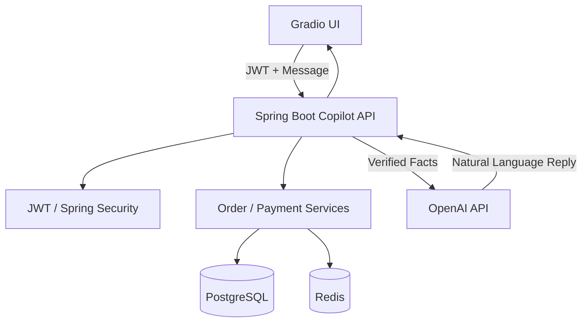

# 🤖 Retail Support Copilot (LLM Integration)

An AI-powered **Retail Support Copilot** built on top of the Retail Backend (Spring Boot).

This module demonstrates **production-grade LLM integration** where the backend remains
the **single source of truth**, and the LLM is used **only for natural-language response generation**.

---

## 🎯 Why This Exists

This Copilot showcases how to integrate Large Language Models into a real backend system
**safely, securely, and realistically**, without:

- letting the LLM access databases directly
- leaking customer data
- hallucinating business facts
- bypassing backend authorization

This mirrors how AI copilots are built in **real production systems**.

---

## 🧠 Core Design Principle

> **The backend owns the truth.  
> The LLM owns the tone.**

- Business logic lives in Spring Boot
- Authorization is enforced server-side (JWT / Spring Security)
- The LLM never executes actions
- The LLM never fetches data
- The LLM only rewrites verified facts

---

## 🏗 Architecture Overview

---

## 🛠️ Implementation Highlights

### 1. Zero-Hallucination Grounding
To prevent the LLM from "making up" order details, I implemented a strict **Fact-Retriever** pattern.
- The backend fetches the real `Order` entity from PostgreSQL.
- It flattens the complex object into a simple "Fact String" (e.g., *"Order #752: Status Shipped, Total $89.00"*).
- This string is injected into the LLM prompt as the **only** source of truth.

### 2. Actionable AI Responses
I designed a custom `CopilotAction` protocol that allows the backend to drive the UI.
- The backend evaluates the context and returns a list of "Actions" (like `OPEN_ORDER_DETAILS`).
- The Gradio frontend parses these actions and **automatically renders buttons**, turning a simple chat into a functional dashboard.

### 3. Secure Multi-Language Flow
This project demonstrates a professional **Polyglot Architecture**:
- **Java (Spring Boot):** Handles security, database integrity, and business rules.
- **Python (Gradio):** Provides a rapid, interactive AI user interface.
- **REST & JWT:** Both layers communicate securely using industry-standard tokens.

---
